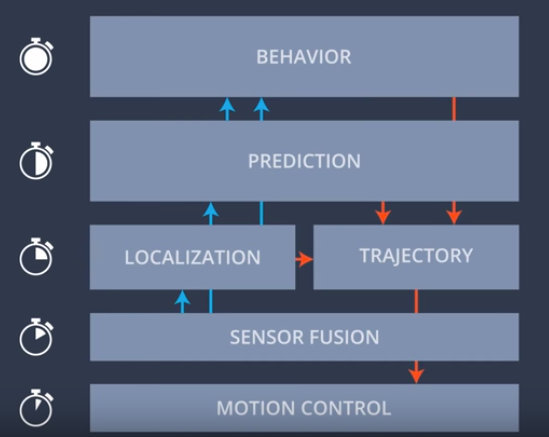

# AD_Reads
Links to publications on autonomous driving development

### [Motion Planning](https://en.wikipedia.org/wiki/Motion_planning):

[1. A Survey of Motion Planning and Control Techniques for Self-driving Urban Vehicles](https://arxiv.org/pdf/1604.07446.pdf)

[2. Task-Motion Planning for Safe and Efficient Urban Driving](https://arxiv.org/pdf/2003.03807.pdf)

[3. Combining Task and Motion Planning for Intersection Assistance Systems](http://mediatum.ub.tum.de/doc/1381861/935530466588.pdf)

[4. Autonomous Driving at Intersections: A Critical-Turning-Point Approach for Left Turns](https://arxiv.org/pdf/2003.02409.pdf)

[5. A unified approach to driver assistance systems based on artificial potential fields](https://pdfs.semanticscholar.org/98a0/9fdf4a235b73713a2702799f13f3cd587df8.pdf)

[6. Motion Planning for Nonholonomic Vehicles: An Introduction](https://hal.inria.fr/inria-00548415/document)

[7. Computing the Shortest Path: A∗ Search Meets Graph Theory](https://www.cs.princeton.edu/courses/archive/spr06/cos423/Handouts/GH05.pdf)

[8. Contraction Hierarchies: Faster and Simpler Hierarchical Routing in Road Networks](http://algo2.iti.kit.edu/schultes/hwy/contract.pdf)

[9. Route Planning in Transportation Networks](https://arxiv.org/pdf/1504.05140.pdf)

[10. Probabilistic MDP-Behavior Planning for Cars](https://www.researchgate.net/publication/256079154_Probabilistic_MDP-Behavior_Planning_for_Cars)

### Data flow

